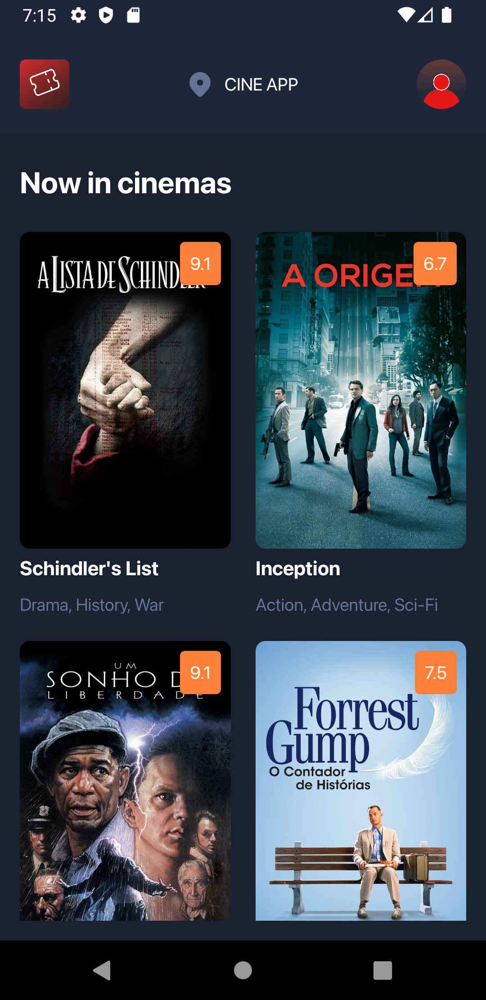

# Cinema App

## Description

The Cinema App is a React Native application that simplifies the process of purchasing movie tickets. With an intuitive and user-friendly interface, users can select their desired movie, preferred session, and available seats. Additionally, if the user has admin privileges, they can validate tickets at the cinema entrance using a QR Code scanner.

## Table of Contents

1. [Screenshots](#screenshots)
2. [Demo Video](#demo-video)
3. [Key Features](#key-features)

## Screenshots

  
  
  
  
  
  
  

## Demo Video

https://github.com/ArthurLopesMagalhaes/CinemaApp/assets/89086128/ebe51f22-5d49-4fda-926d-23df8b23aa40

https://github.com/ArthurLopesMagalhaes/CinemaApp/assets/89086128/4daf0901-7c1f-4459-ab2f-7ffab57738c0

## Key Features

- **Ticket Purchase**: Users can browse currently showing movies, select their preferred session, and choose available seats for purchase.

- **Ticket Validation**: Admins can use the QR Code scanner feature to validate tickets at the cinema entrance.

- **Integration with Supabase**: The app uses Supabase as the backend to store information about movies, sessions, and users.

- **Payments with Stripe**: Integration with Stripe allows for secure and fast payment processing for ticket purchases.
